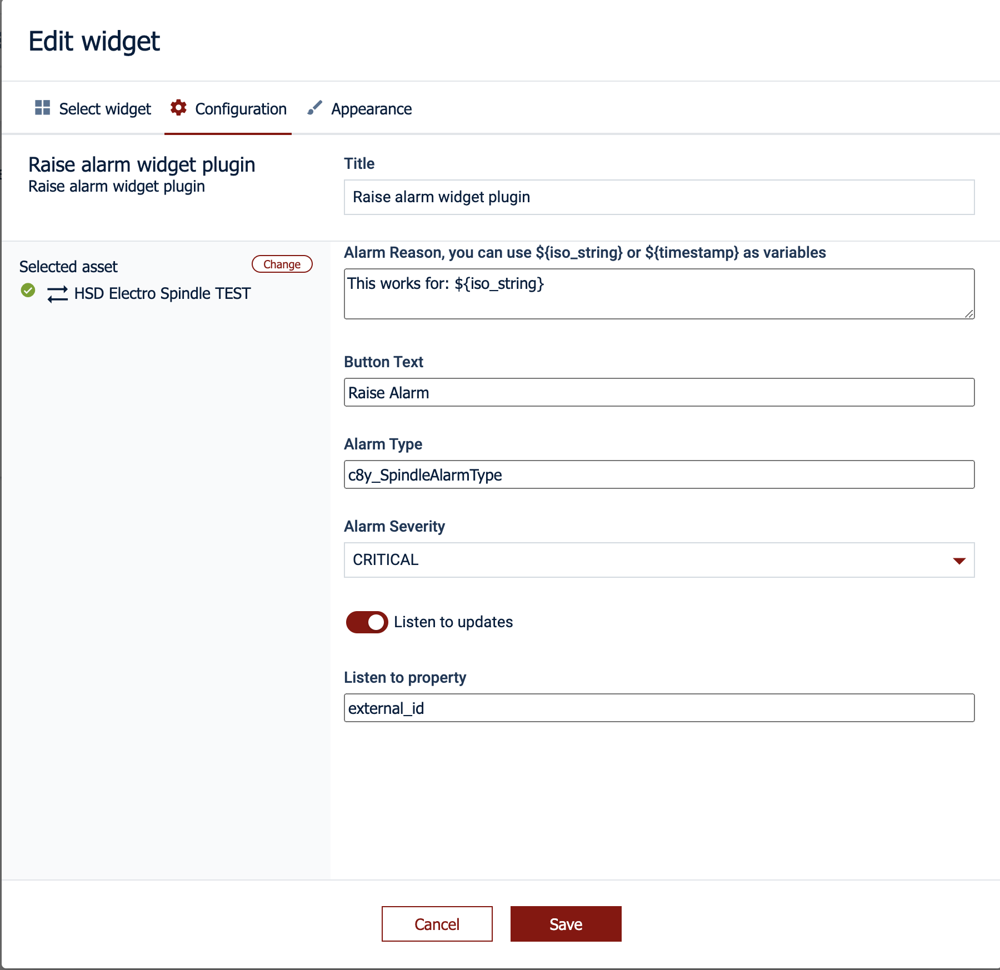

# cumulocity-plugin-raise-alarm
Plugin installs as a widget and allows to create an alarm.
The configuration allows to define: severity, alarm reason, and update behaviour.

The configuration is as follows:

----
These tools are provided as-is and without warranty or support. They do not constitute part of the Software AG product suite. Users are free to use, fork and modify them, subject to the license agreement. While Software AG welcomes contributions, we cannot guarantee to include every contribution in the master project.
